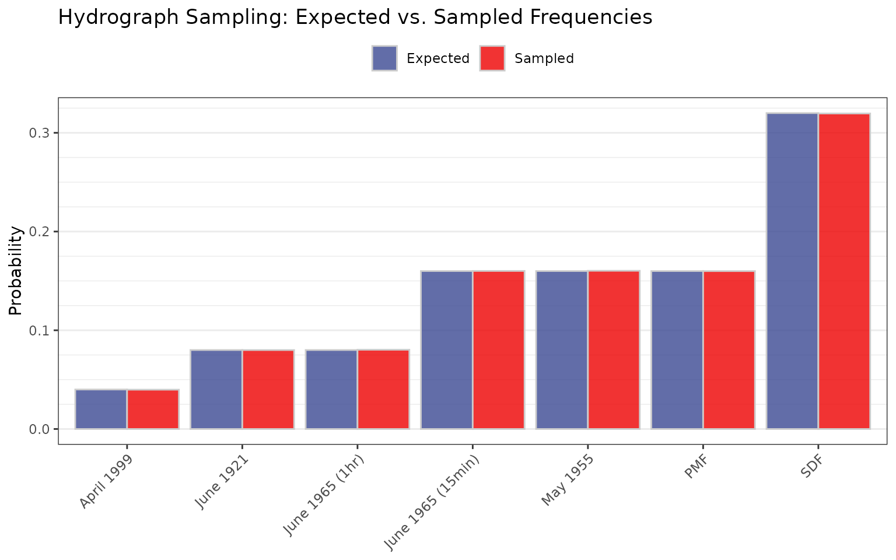

# Hydrograph Shape Sampling Validation

## Purpose

Validate that the hydrograph shape sampling module correctly applies
user-specified weights when selecting hydrograph shapes during
simulation. This test validates that
[`hydrograph_setup()`](https://usace-rmc.github.io/rfaR/reference/hydrograph_setup.md)
correctly normalizes weights to probabilities and that
[`sample()`](https://rdrr.io/r/base/sample.html) using those
probabilities reproduces the expected distribution.

## Input Data

Seven example hydrographs are loaded via
[`hydrograph_setup()`](https://usace-rmc.github.io/rfaR/reference/hydrograph_setup.md)
with the following user-specified weights:

``` r
hydrograph_names <- c("April 1999", "June 1921", "June 1965 (1hr)",
                      "June 1965 (15min)", "May 1955", "PMF", "SDF")
weights <- c(0.5, 1, 1, 2, 2, 2, 4)
expected_probs <- weights / sum(weights)
```

| Hydrograph        | Weight | Expected Prob. | Expected Prob. Fraction |
|:------------------|-------:|---------------:|:------------------------|
| April 1999        |    0.5 |           0.04 | 0.5/12.5                |
| June 1921         |    1.0 |           0.08 | 1/12.5                  |
| June 1965 (1hr)   |    1.0 |           0.08 | 1/12.5                  |
| June 1965 (15min) |    2.0 |           0.16 | 2/12.5                  |
| May 1955          |    2.0 |           0.16 | 2/12.5                  |
| PMF               |    2.0 |           0.16 | 2/12.5                  |
| SDF               |    4.0 |           0.32 | 4/12.5                  |

Hydrograph Sampling Weights and Normalized Probabilities

## Test

Set up hydrographs with weights, then sample 1,000,000 times and compare
the sampled frequencies to the expected probabilities.

``` r
set.seed(42)

hydrographs <- hydrograph_setup(jmd_hydro_apr1999,
                                jmd_hydro_jun1921,
                                jmd_hydro_jun1965,
                                jmd_hydro_jun1965_15min,
                                jmd_hydro_may1955,
                                jmd_hydro_pmf,
                                jmd_hydro_sdf,
                                critical_duration = 2,
                                routing_days = 10,
                                weights = weights)

Nsims <- 1000000
hydro_probs <- attr(hydrographs, "probs")
hydroSamps <- sample(1:length(hydrographs), size = Nsims, replace = TRUE,
                     prob = hydro_probs)
sample_freq <- tabulate(hydroSamps, nbins = length(hydro_probs)) / Nsims
```

| Hydrograph        | Weight | Expected Prob. | Sampled Freq. | Difference |
|:------------------|-------:|---------------:|--------------:|-----------:|
| April 1999        |    0.5 |           0.04 |        0.0398 |     -2e-04 |
| June 1921         |    1.0 |           0.08 |        0.0800 |      0e+00 |
| June 1965 (1hr)   |    1.0 |           0.08 |        0.0803 |      3e-04 |
| June 1965 (15min) |    2.0 |           0.16 |        0.1601 |      1e-04 |
| May 1955          |    2.0 |           0.16 |        0.1603 |      3e-04 |
| PMF               |    2.0 |           0.16 |        0.1600 |      0e+00 |
| SDF               |    4.0 |           0.32 |        0.3196 |     -4e-04 |

Expected vs. Sampled Hydrograph Frequencies (N = 1,000,000)




## Acceptance Criterion

Sampled frequencies must be within 1% relative tolerance of the expected
probabilities, consistent with
`expect_equal(sample_freq, hydro_probs, tolerance = 0.01)`.

| Metric                      | Value              |
|-----------------------------|--------------------|
| Maximum Relative Difference | 0.0042             |
| Tolerance                   | 0.01 (1% relative) |
| **Result**                  | **PASS**           |
