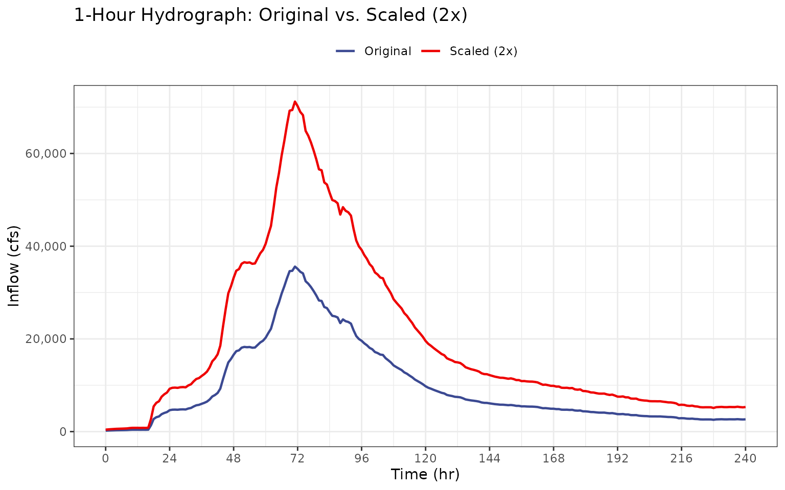
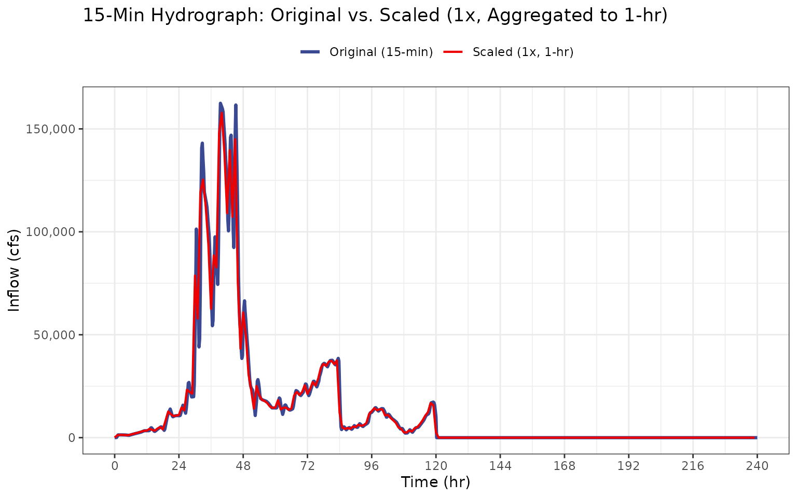

# Hydrograph Scaling Validation

## Purpose

Validate that
[`scale_hydrograph()`](https://ideal-broccoli-1q9y47z.pages.github.io/reference/scale_hydrograph.md)
correctly scales inflow hydrographs and converts between timesteps. This
test covers three cases:

1.  **1-hour input, 1-hour routing** — Verify that the scale factor is
    applied correctly and output dimensions are preserved.
2.  **15-minute input, 1-hour routing** — Verify that block averaging
    produces the correct timestep, row count, and ordinate values.
3.  **Edge cases** — Verify behavior with a scale factor of 1 and
    non-negative flow output.

## Setup

``` r
hydrographs <- hydrograph_setup(jmd_hydro_apr1999,
                                jmd_hydro_jun1921,
                                jmd_hydro_jun1965,
                                jmd_hydro_jun1965_15min,
                                jmd_hydro_may1955,
                                jmd_hydro_pmf,
                                jmd_hydro_sdf,
                                critical_duration = 2,
                                routing_days = 10)

hydro_1hr   <- hydrographs[[1]]
hydro_15min <- hydrographs[[4]]

obs_vol    <- attr(hydro_1hr, "obs_vol")
obs_vol_15 <- attr(hydro_15min, "obs_vol")

sampled_vol_2x    <- obs_vol * 2
sampled_vol_15_2x <- obs_vol_15 * 2
```

| Hydrograph         | Timestep (hr) | Rows | Observed Volume |
|:-------------------|--------------:|-----:|----------------:|
| April 1999 (1-hr)  |          1.00 |  241 |        25313.96 |
| June 1965 (15-min) |          0.25 |  961 |        53445.41 |

Input Hydrograph Summary

------------------------------------------------------------------------

## Test 1: 1-Hour Input, 1-Hour Routing

Scale the April 1999 hydrograph by a factor of 2 with matching input and
routing timesteps (1-hour).

``` r
scaled_1hr <- scale_hydrograph(
  hydrograph_shape = hydro_1hr[, c("hour", "inflow")],
  observed_volume  = obs_vol,
  sampled_volume   = sampled_vol_2x,
  routing_dt       = 1)
```

| Check                                        | Result |
|:---------------------------------------------|:-------|
| Output class is data.frame                   | TRUE   |
| Column names correct                         | TRUE   |
| Time starts at 0                             | TRUE   |
| Row count preserved                          | TRUE   |
| Scale factor applied (all ordinates doubled) | TRUE   |

1-Hour Input / 1-Hour Routing Checks



### Acceptance Criterion

------------------------------------------------------------------------

## Test 2: 15-Minute Input, 1-Hour Routing (Block Average)

Scale the June 1965 (15-min) hydrograph by a factor of 1 with block
averaging to 1-hour routing timestep.

``` r
scaled_15min <- scale_hydrograph(
  hydrograph_shape = hydro_15min[, c("hour", "inflow")],
  observed_volume  = obs_vol_15,
  sampled_volume   = obs_vol_15,
  routing_dt       = 1)

expected_rows <- floor(nrow(hydro_15min) / 4)
dt_out <- scaled_15min$time_hrs[2] - scaled_15min$time_hrs[1]
expected_first <- mean(hydro_15min$inflow[1:4]) * 1
```

| Check                                               | Expected | Actual | Pass |
|:----------------------------------------------------|:---------|:-------|:-----|
| Row count (15-min to 1-hr, factor of 4 reduction)   | 240      | 240    | TRUE |
| Output timestep is 1 hour                           | 1        | 1      | TRUE |
| Time starts at 0                                    | 0        | 0      | TRUE |
| First ordinate matches manual block average × scale | 36.5     | 36.5   | TRUE |

15-Minute Input / 1-Hour Routing Checks



### Acceptance Criterion

------------------------------------------------------------------------

## Test 3: Edge Cases

**Unity scaling** `(sampled_volume = obs_vol)` verifies that when the
sampled flood volume exactly matches the observed hydrograph volume, the
scaling operation is a no-op — the output ordinates are identical to the
input within floating point tolerance. This is an important baseline
check: any scaling implementation that distorts the hydrograph shape
when the scale factor is 1.0 has a fundamental error.

**Non-negative flows** verifies that the scaled hydrograph contains no
negative inflow values. This can be a non-trivial failure mode when the
scaling procedure involves interpolation, baseline correction, or any
arithmetic that operates on near-zero recession limb ordinates. Negative
inflows are physically meaningless and would corrupt the Modified Puls
routing by implying water is being withdrawn from the reservoir by the
inflow boundary condition.

``` r
# Scale factor = 1 (same volume)
scaled_unity <- scale_hydrograph(
  hydrograph_shape = hydro_1hr[, c("hour", "inflow")],
  observed_volume  = obs_vol,
  sampled_volume   = obs_vol,
  routing_dt       = 1
)

unity_match <- isTRUE(all.equal(scaled_unity$inflow_cfs, hydro_1hr$inflow, tolerance = 1e-10))

# Non-negative flows
scaled_2x <- scale_hydrograph(
  hydrograph_shape = hydro_1hr[, c("hour", "inflow")],
  observed_volume  = obs_vol,
  sampled_volume   = sampled_vol_2x,
  routing_dt       = 1
)

all_nonneg <- all(scaled_2x$inflow_cfs >= 0)
```

| Check                                            | Result |
|:-------------------------------------------------|:-------|
| Scale factor = 1 returns unchanged ordinates     | TRUE   |
| All flows non-negative for positive scale factor | TRUE   |

Edge Case Checks

### Acceptance Criterion

------------------------------------------------------------------------

## Summary

| Test | Description                                  | Result   |
|------|----------------------------------------------|----------|
| 1    | 1-hour input, 1-hour routing — scaling       | **PASS** |
| 2    | 15-min input, 1-hour routing — block average | **PASS** |
| 3    | Edge cases — unity scale, non-negative flows | **PASS** |
