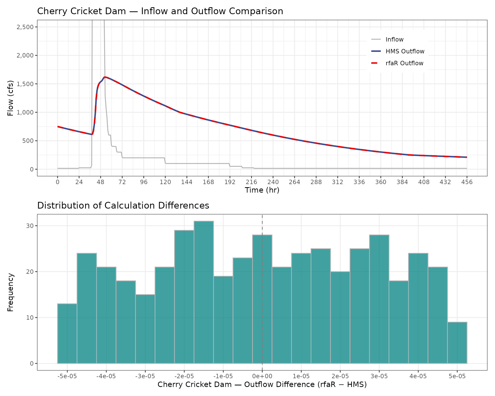

# V7 - Modified-Puls Routing Validation

## Purpose

Validate that
[`mod_puls_routing()`](https://ideal-broccoli-1q9y47z.pages.github.io/reference/mod_puls_routing.md)
produces results consistent with HEC-HMS Modified Puls routing for a
benchmark dataset at Cherry Cricket Dam. The comparison benchmark uses
an identical reservoir model, inflow hydrograph, and initial condition
routed independently in HEC-HMS.

------------------------------------------------------------------------

## Modified Puls Routing

The Modified Puls routing method, also known as storage routing or
level-pool routing, is based upon a finite difference approximation of
the continuity equation, coupled with an empirical representation of the
momentum equation (Chow, 1964; Henderson, 1966; HEC, 2025). The full
derivation of the Mod-Puls routing equation from the continuity equation
can be found in the rfaR Reference Manual.

Mod-Puls routing uses the known inflow, outflow, and storage at time
*t-1* and the known inflow at time *t* to estimate the the storage
indicator at time *t*. The storage indicator uses the
stage-storage-discharge relationship (`your_res_model`) to determine the
outflow at time *t*.

$$SI_{t} = \frac{I_{t - 1} + I_{t}}{2} + \left( \frac{S_{t - 1}}{\Delta t} - \frac{O_{t - 1}}{2} \right)$$

------------------------------------------------------------------------

## Test

``` r
cc_routing <- mod_puls_routing(resmodel_df = cc_resmodel,
                               inflow_df = cc_inflowhydro,
                               initial_elev = cc_init_elev,
                               full_results = TRUE)

cc_diff_elev <- cc_routing$elevation_ft - cc_hms_results$elevation_ft
cc_diff_outflow <- cc_routing$outflow_cfs - cc_hms_results$outflow_cfs

cc_max_diff_elev <- max(abs(cc_diff_elev))
cc_max_diff_outflow <- max(abs(cc_diff_outflow))
```

| Metric                      |     rfaR |  HEC-HMS |
|:----------------------------|---------:|---------:|
| Peak Elevation (ft)         | 5572.943 | 5572.943 |
| Peak Outflow (cfs)          | 1617.820 | 1617.820 |
| Max Abs Diff Elevation (ft) |    0.000 |       NA |
| Max Abs Diff Outflow (cfs)  |    0.000 |       NA |

Cherry Creek Dam Routing Comparison



### Acceptance Criterion

Maximum absolute difference must be less than 0.1 ft for elevation and
1.0 cfs for outflow.

| Metric                 | Value    | Tolerance |
|------------------------|----------|-----------|
| Max Abs Diff Elevation | 0 ft     | 0.1 ft    |
| Max Abs Diff Outflow   | 0 cfs    | 1.0 cfs   |
| **Result (Elevation)** | **PASS** |           |
| **Result (Outflow)**   | **PASS** |           |

------------------------------------------------------------------------

## Summary

| Test | Dam            | Variable  | Result   |
|------|----------------|-----------|----------|
| 1a   | Cherry Cricket | Elevation | **PASS** |
| 1b   | Cherry Cricket | Outflow   | **PASS** |

## References

U.S. Army Corps of Engineers, Hydrologic Engineering Center. (n.d.).
Modified Puls Model. HEC-HMS Technical Reference Manual. Retrieved
December 18, 2025, from
<https://www.hec.usace.army.mil/confluence/hmsdocs/hmstrm/channel-flow/modified-puls-model>
