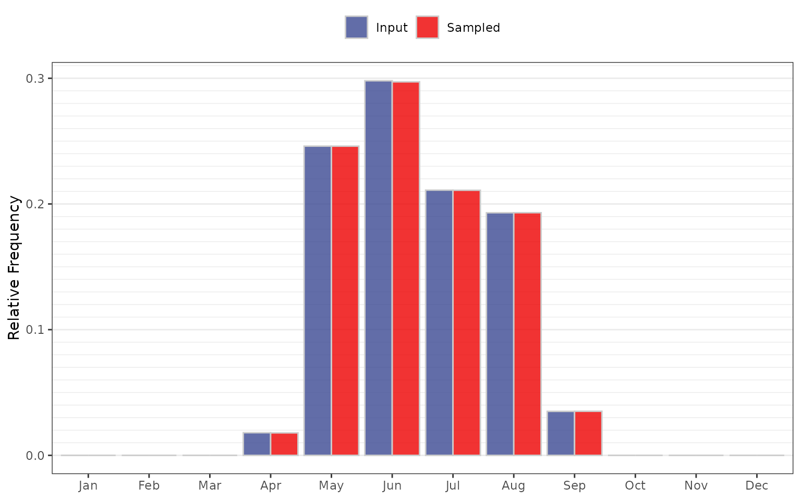
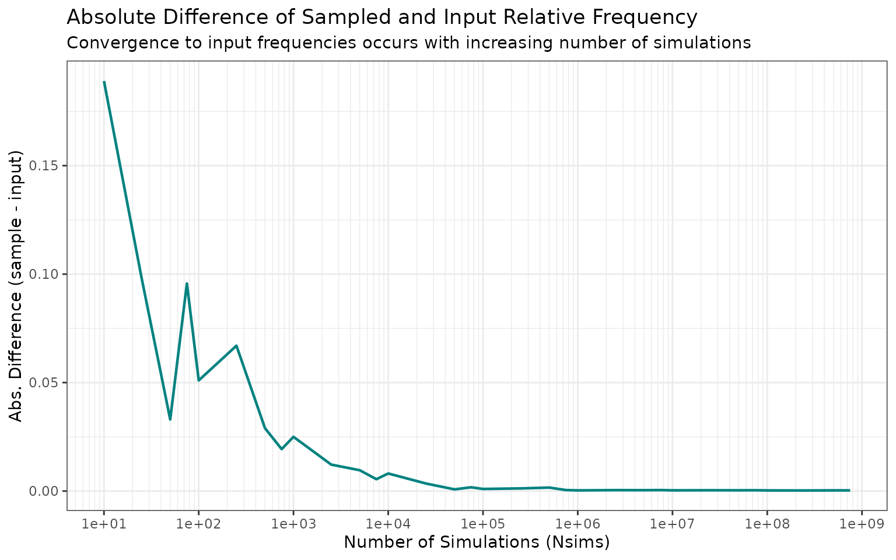

# Seasonality Sampling Validation

## Purpose

Verify that the seasonality sampling processes/module reproduces the
input relative frequencies (within Monte Carlo variability).

The seasonality module creates a sequence of calendar months that is
`Nsims` in length. The sampling probability is based on the historical
relative frequency of flood events. This test validates the application
of [`sample()`](https://rdrr.io/r/base/sample.html) within
`rfa_similate()` produces a sampled distribution consistent with the
input.

## Input Data

The input seasonality distribution is stored in
`jmd_seasonality$relative_frequency`, a vector of 12 monthly
probabilities that sum to 1.

``` r
seasonality_prob <- jmd_seasonality$relative_frequency

input_df <- data.frame(Month = month.abb,
                       Relative_Frequency = seasonality_prob)
```

| Month     | Frequency | Relative Frequency | Cumulative Rel. Frequency |
|:----------|----------:|-------------------:|--------------------------:|
| January   |         0 |              0.000 |                     0.000 |
| February  |         0 |              0.000 |                     0.000 |
| March     |         0 |              0.000 |                     0.000 |
| April     |         1 |              0.018 |                     0.018 |
| May       |        14 |              0.246 |                     0.263 |
| June      |        17 |              0.298 |                     0.561 |
| July      |        12 |              0.211 |                     0.772 |
| August    |        11 |              0.193 |                     0.965 |
| September |         2 |              0.035 |                     1.000 |
| October   |         0 |              0.000 |                     1.000 |
| November  |         0 |              0.000 |                     1.000 |
| December  |         0 |              0.000 |                     1.000 |

JMD Seasonality Input Distribution

## Test

Sample 1,000,000 months using the input probabilities, then compare the
sampled relative frequencies to the input.

``` r
set.seed(42)
Nsims <- 1000000

InitMonths <- sample(1:12, size = Nsims, replace = TRUE, prob = seasonality_prob)
sample_freq <- tabulate(InitMonths, nbins = 12) / Nsims
```

| Month | Input Frequency | Sampled Frequency | Difference | Percent Difference |
|:------|----------------:|------------------:|-----------:|-------------------:|
| Jan   |           0.000 |            0.0000 |      0e+00 |                NaN |
| Feb   |           0.000 |            0.0000 |      0e+00 |                NaN |
| Mar   |           0.000 |            0.0000 |      0e+00 |                NaN |
| Apr   |           0.018 |            0.0179 |     -1e-04 |            -0.7333 |
| May   |           0.246 |            0.2460 |      0e+00 |            -0.0073 |
| Jun   |           0.298 |            0.2971 |     -9e-04 |            -0.2866 |
| Jul   |           0.211 |            0.2109 |     -1e-04 |            -0.0479 |
| Aug   |           0.193 |            0.1930 |      0e+00 |             0.0197 |
| Sep   |           0.035 |            0.0351 |      1e-04 |             0.1914 |
| Oct   |           0.000 |            0.0000 |      0e+00 |                NaN |
| Nov   |           0.000 |            0.0000 |      0e+00 |                NaN |
| Dec   |           0.000 |            0.0000 |      0e+00 |                NaN |

Input vs. Sampled Seasonality Frequencies (N = 1,000,000)



## Acceptance Criterion

Sampled relative frequencies must be within 1% relative tolerance of the
input probabilities, consistent with
`expect_equal(sample_freq, seasonality_prob, tolerance = 0.01)`.

| Metric                      | Value              |
|-----------------------------|--------------------|
| Maximum Relative Difference | 0.007333           |
| Tolerance                   | 0.01 (1% relative) |
| **Result**                  | **PASS**           |
