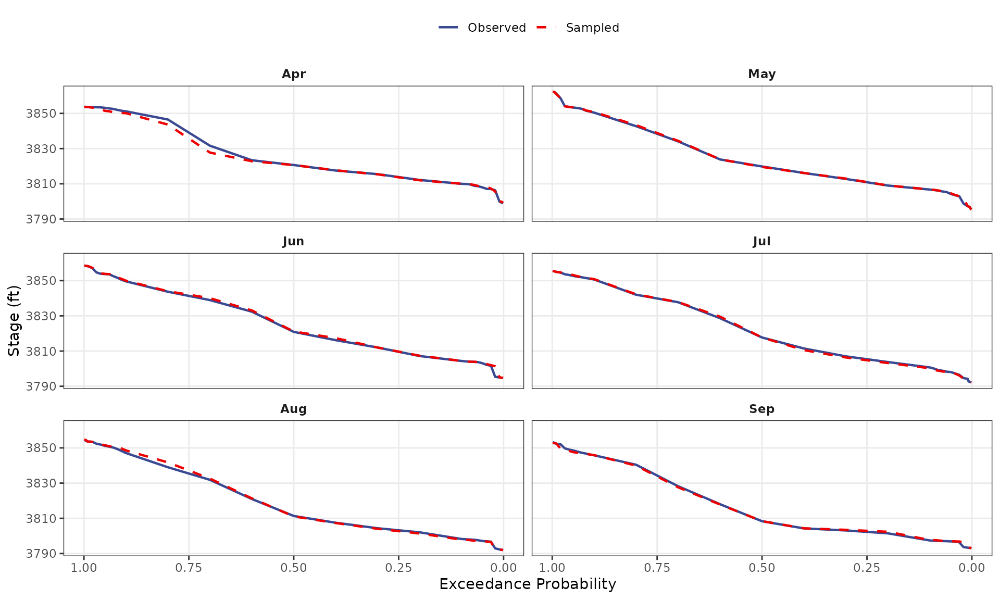

# Starting Stage Sampling Validation

## Purpose

Verify that the starting stage sampling processes/module produces a
reliable sequence of starting stages that represents the observed
stage-duration (quantiles) of the input stage timeseries data.

The starting stage sampling processes produces creates a sequence of
reservoir stages which is `Nsims` in length. Starting stages are sampled
randomly from the observed record based on randomly sampled months
(`InitMonths`). Similar to the seasonality sampling process, this test
validates the application of
[`sample()`](https://rdrr.io/r/base/sample.html) within `rfa_similate()`
produces a sample of stages consistent with the input.

This involves two tests:

1.  **Stage Duration Curve Verification** — Confirm that quantiles
    computed directly from the observed stage time series (`stage_ts`)
    match the `jmd_stage_duration` dataset included in the package.

2.  **Sampled Stage Validation** — Confirm that stages sampled via the
    seasonality-weighted sampling process reproduce the observed stage
    quantiles within acceptable tolerance.

## Input Data

The observed stage record (`stage_ts <- jmd_wy1980_stage`) contains
daily pool elevation readings. The `jmd_stage_duration` dataset contains
pre-computed monthly stage duration curves at specified exceedance
probabilities.

``` r
stage_ts <- jmd_wy1980_stage
stage_ts$months <- lubridate::month(lubridate::mdy(jmd_wy1980_stage$date))
stage_ts <- stage_ts[!is.na(stage_ts$months), ]

probs <- 1 - jmd_stage_duration$Probability
```

------------------------------------------------------------------------

## Test 1: Observed Quantiles vs. Package Dataset

Compute stage quantiles directly from the observed time series for each
month and compare against `jmd_stage_duration` (“Observed Stage
Duration”).

``` r
obs_quantiles <- sapply(1:12, function(m) {
  unname(quantile(stage_ts$stage_ft[stage_ts$months == m],
                  probs, na.rm = TRUE))
})

sd_matrix <- as.matrix(jmd_stage_duration[, -1])
diff_matrix <- obs_quantiles - sd_matrix
max_diff_obs <- max(abs(diff_matrix), na.rm = TRUE)
```

|           | Month | Max Absolute Difference (ft) |
|:----------|:------|-----------------------------:|
| January   | Jan   |                       0.0048 |
| February  | Feb   |                       0.0050 |
| March     | Mar   |                       0.0048 |
| April     | Apr   |                       0.0050 |
| May       | May   |                       0.0048 |
| June      | Jun   |                       0.0050 |
| July      | Jul   |                       0.0050 |
| August    | Aug   |                       0.0048 |
| September | Sep   |                       0.0046 |
| October   | Oct   |                       0.0048 |
| November  | Nov   |                       0.0050 |
| December  | Dec   |                       0.0050 |

Maximum Difference Between Computed and Observed Stage Duration Curves

### Acceptance Criterion

Maximum absolute difference must be less than 0.01 ft, consistent with
`expect_lt(max_diff, 0.01)`.

| Metric                      | Value    |
|-----------------------------|----------|
| Maximum Absolute Difference | 0.005 ft |
| Tolerance                   | 0.01 ft  |
| **Result**                  | **PASS** |

------------------------------------------------------------------------

## Test 2: Sampled Stage Quantiles vs. Observed Stage Quantiles

Sample 10,000 stages using the seasonality and starting stage sampling
process in
[`rfa_simulate()`](https://usace-rmc.github.io/rfaR/reference/rfa_simulate.md):

1.  Sample 10,000 months using the JMD seasonality distribution
    (`jmd_seasonality$relative_frequency`)

2.  Sample a starting stage from the observed record for that month.

Compare the resulting stage duration curves against the observed curves.

``` r
set.seed(42)

seasonality_prob <- jmd_seasonality$relative_frequency
Nsims <- 10000

InitMonths <- sample(1:12, size = Nsims, replace = TRUE, prob = seasonality_prob)
InitStages <- numeric(Nsims)

UniqMonths <- sort(unique(InitMonths))
for (i in 1:length(UniqMonths)) {
  sampleID <- which(InitMonths == UniqMonths[i])
  InitStages[sampleID] <- sample(stage_ts$stage_ft[stage_ts$months %in% UniqMonths[i]],
                                 size = sum(InitMonths == UniqMonths[i]), replace = TRUE)
}

sample_stages <- data.frame(months = InitMonths, stage_ft = InitStages)
```

| Month | Max Percent Difference (%) |
|:------|---------------------------:|
| Apr   |                     0.1020 |
| May   |                     0.0776 |
| Jun   |                     0.1584 |
| Jul   |                     0.0376 |
| Aug   |                     0.0719 |
| Sep   |                     0.0673 |

Maximum Percent Difference Between Sampled and Observed Stage Quantiles

**Months not sampled** (zero seasonality probability): Jan, Feb, Mar,
Oct, Nov, Dec. These months correctly produce no samples.



### Acceptance Criterion

Maximum percent difference between sampled and observed stage quantiles
must be less than 5%, consistent with `expect_lt(pct_diff, 5)`.

| Metric                     | Value    |
|----------------------------|----------|
| Maximum Percent Difference | 0.1584%  |
| Tolerance                  | 5%       |
| **Result**                 | **PASS** |

------------------------------------------------------------------------

## Summary

| Test | Description                                             | Result   |
|------|---------------------------------------------------------|----------|
| 1    | Observed quantiles match `jmd_stage_duration` quantiles | **PASS** |
| 2    | Sampled stage quantiles within 5% of observed quantiles | **PASS** |
