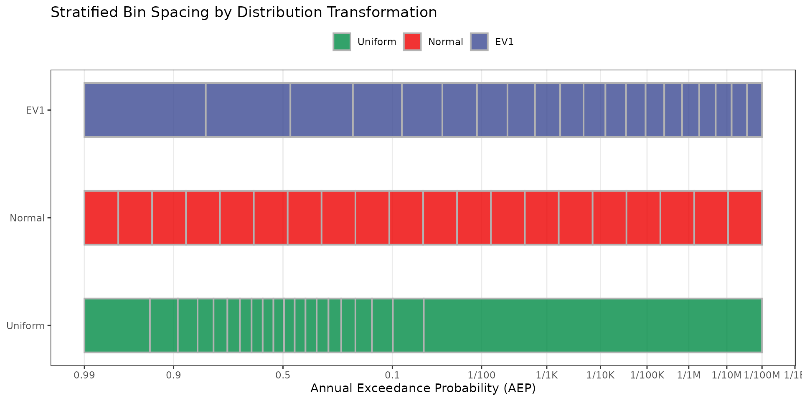
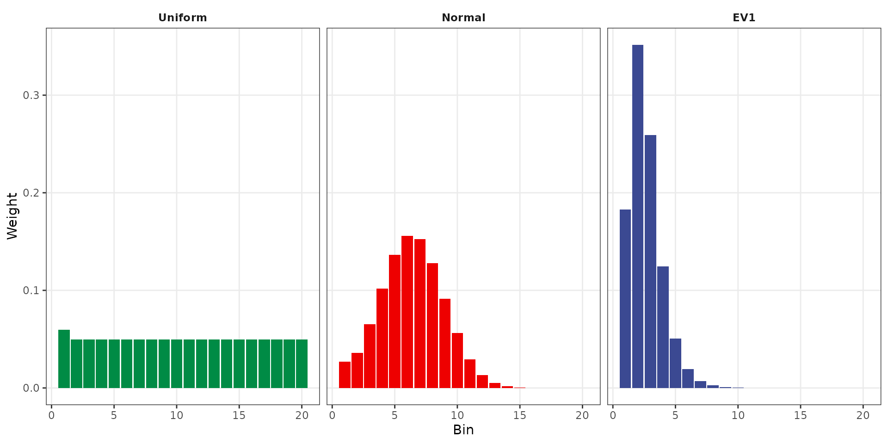

# V1 - Stratified Sampling Validation

## Purpose

Validate that
[`stratified_sampler()`](https://ideal-broccoli-1q9y47z.pages.github.io/reference/stratified_sampler.md)
correctly creates stratified bins and weights for all three supported
distribution transformations: Extreme Value Type I (EV1), Normal, and
Uniform. Tests cover bin boundary accuracy against the
`stratified_example` dataset, weight accuracy, weight summation, output
dimensions, and bin ordering.

## Background

Stratified sampling divides the probability space into bins to ensure
adequate coverage of rare events. The choice of transformation
determines how bins are distributed:

- **Uniform** — Equal probability width per bin.
- **Normal** — Uniform spacing in standard normal (z-score) space.
- **EV1 (Gumbel)** — Spacing in Gumbel reduced variate space.

------------------------------------------------------------------------

## Test 1: Bin Spacing Visualization

The following plot illustrates how each transformation distributes bin
boundaries along the z-variate axis. Tick marks show the z-lower
boundary of each bin. EV1 stratification produces wider spacing at
common events (left) and tighter spacing at rare events (right),
concentrating sampling effort where it matters most for dam safety/risk
analysis.

``` r
ev1 <- stratified_sampler(dist = "EV1")
normal <- stratified_sampler(dist = "Normal")
uniform <- stratified_sampler(dist = "Uniform")

# Shared x-axis range
xlim <- range(c(ev1$Zlower, ev1$Zupper,
                normal$Zlower, normal$Zupper,
                uniform$Zlower, uniform$Zupper))

bin_spacing <- bind_rows(
  data.frame(dist = "EV1",     xmin = ev1$Zlower,     xmax = ev1$Zupper),
  data.frame(dist = "Normal",  xmin = normal$Zlower,  xmax = normal$Zupper),
  data.frame(dist = "Uniform", xmin = uniform$Zlower, xmax = uniform$Zupper)) |>
  mutate(dist = factor(dist, levels = c("Uniform", "Normal", "EV1")))

# Plot
aep_breaks <- c(9.9e-1, 9e-1, 5e-1, 1e-1, 1e-2, 1e-3, 1e-4, 1e-5, 1e-6, 1e-7, 1e-8, 1e-9, 1e-10)
aep_labels <- c("0.99", "0.9", "0.5", "0.1", "1/100", "1/1K",
           "1/10K", "1/100K", "1/1M", "1/10M", "1/100M", "1/1B", "1/10B")
zbreaks <- qnorm(1 - aep_breaks)

ggplot(bin_spacing) +
  geom_rect(aes(xmin = xmin, xmax = xmax,
                ymin = as.numeric(dist) - 0.25,
                ymax = as.numeric(dist) + 0.25,
                fill = dist),
            color = "grey70", linewidth = .7, alpha = 0.8) +
  scale_y_continuous(breaks = 1:3, labels = levels(bin_spacing$dist)) +
  scale_x_continuous(breaks = zbreaks, labels = aep_labels)+
  scale_fill_manual(values = c("Uniform" = "#008B45FF",
                               "Normal"  = "#EE0000FF",
                               "EV1"     = "#3B4992FF")) +
  labs(x = "Annual Exceedance Probability (AEP)",
       y = NULL,
       title = "Stratified Bin Spacing by Distribution Transformation",
       fill = NULL) +
  theme_bw() +
  theme(legend.position  = "top",
        panel.grid.minor = element_blank(),
        panel.grid.major.y = element_blank())
```





The weight distribution shows how each transformation allocates
probability across bins. Uniform produces nearly equal weights. Normal
concentrates weight in central bins. EV1 places the most weight in the
first few bins (frequent events) with rapidly decreasing weight for rare
event bins, reflecting the heavy-tailed nature of flood distributions.

------------------------------------------------------------------------

## Test 2: Z-Lower Bin Boundaries Match Validation Data

Compare computed z-lower bin boundaries against the `stratified_example`
dataset.

``` r
ev1_idx <- which(example_stratified$distribution == "ev1")
normal_idx <- which(example_stratified$distribution == "normal")
uniform_idx <- which(example_stratified$distribution == "uniform")

# Convert validation data to z-space
z_lower_valid <- numeric(nrow(example_stratified))
z_lower_valid[uniform_idx] <- qnorm(1 - example_stratified$lower[uniform_idx])
z_lower_valid[normal_idx] <- example_stratified$lower[normal_idx]
z_lower_valid[ev1_idx] <- qnorm(exp(-exp(-example_stratified$lower[ev1_idx])))

diff_ev1 <- ev1$Zlower - z_lower_valid[ev1_idx]
diff_normal <- normal$Zlower - z_lower_valid[normal_idx]
diff_uniform <- uniform$Zlower - z_lower_valid[uniform_idx]
```

| Distribution | Max Abs. Difference |
|:-------------|--------------------:|
| EV1          |             9.0e-10 |
| Normal       |             5.0e-10 |
| Uniform      |             4.9e-09 |

Z-Lower Bin Boundary Differences vs. Validation Data

### Acceptance Criterion

| Metric     | Value    |
|------------|----------|
| Tolerance  | 10^{-6}  |
| **Result** | **PASS** |

------------------------------------------------------------------------

## Test 3: Weights Match Validation Data

Compare computed bin weights against the `stratified_example` dataset.

``` r
wt_diff_ev1 <- ev1$Weights - example_stratified$weight[ev1_idx]
wt_diff_normal <- normal$Weights - example_stratified$weight[normal_idx]
wt_diff_uniform <- uniform$Weights - example_stratified$weight[uniform_idx]
```

| Distribution | Max Abs. Difference |
|:-------------|--------------------:|
| EV1          |            4.53e-08 |
| Normal       |            3.79e-08 |
| Uniform      |            5.00e-10 |

Weight Differences vs. Validation Data

### Acceptance Criterion

| Metric     | Value    |
|------------|----------|
| Tolerance  | 10^{-6}  |
| **Result** | **PASS** |

------------------------------------------------------------------------

## Test 4: Weights Sum to 1

``` r
sum_ev1 <- sum(ev1$Weights)
sum_normal <- sum(normal$Weights)
sum_uniform <- sum(uniform$Weights)
```

| Distribution | Sum of Weights | \|1 - Sum\| |
|:-------------|---------------:|------------:|
| EV1          |              1 |           0 |
| Normal       |              1 |           0 |
| Uniform      |              1 |           0 |

Weight Summation Check

### Acceptance Criterion

| Metric     | Value    |
|------------|----------|
| Tolerance  | 10^{-10} |
| **Result** | **PASS** |

------------------------------------------------------------------------

## Test 5: Output Dimensions

Verify that
[`stratified_sampler()`](https://ideal-broccoli-1q9y47z.pages.github.io/reference/stratified_sampler.md)
returns the correct number of bins, events, and vector lengths.

``` r
test_custom <- stratified_sampler(Nbins = 10, Mevents = 100)

dim_results <- data.frame(
  Parameter = c("Nbins", "Mevents", "length(normOrd)", "length(Zlower)",
                "length(Zupper)", "length(Weights)"),
  Expected = c(10, 100, 1000, 10, 10, 10),
  Actual = c(test_custom$Nbins, test_custom$Mevents, length(test_custom$normOrd),
             length(test_custom$Zlower), length(test_custom$Zupper), length(test_custom$Weights))
)
```

| Parameter       | Expected | Actual | Pass |
|:----------------|---------:|-------:|:-----|
| Nbins           |       10 |     10 | TRUE |
| Mevents         |      100 |    100 | TRUE |
| length(normOrd) |     1000 |   1000 | TRUE |
| length(Zlower)  |       10 |     10 | TRUE |
| length(Zupper)  |       10 |     10 | TRUE |
| length(Weights) |       10 |     10 | TRUE |

Output Dimension Verification (Nbins=10, Mevents=100)

### Acceptance Criterion

| Metric     | Value    |
|------------|----------|
| **Result** | **PASS** |

------------------------------------------------------------------------

## Test 6: Bin Ordering (Zlower \< Zupper)

Verify that all bin lower bounds are strictly less than upper bounds.

| Distribution | All Zlower \< Zupper |
|:-------------|:---------------------|
| EV1          | TRUE                 |
| Normal       | TRUE                 |
| Uniform      | TRUE                 |

Bin Ordering Verification

### Acceptance Criterion

``` r
pass_order <- all(order_results$All_Ordered)
```

| Metric     | Value    |
|------------|----------|
| **Result** | **PASS** |

------------------------------------------------------------------------

## Summary

| Test | Description                              | Result   |
|------|------------------------------------------|----------|
| 1    | Bin spacing visualization                | (Visual) |
| 2    | Z-lower boundaries match validation data | **PASS** |
| 3    | Weights match validation data            | **PASS** |
| 4    | Weights sum to 1                         | **PASS** |
| 5    | Output dimensions correct                | **PASS** |
| 6    | Bin ordering (Zlower \< Zupper)          | **PASS** |
