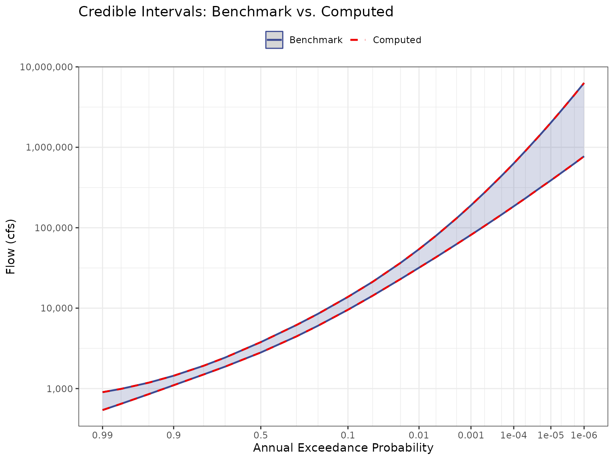

# V2 - Validation of BestFit Parameter Sets

## Purpose

Validate that the
[`qp3()`](https://ideal-broccoli-1q9y47z.pages.github.io/reference/qp3.md)
function and
[`lmom::cdfpe3()`](https://rdrr.io/pkg/lmom/man/cdfpe3.html) correctly
reproduce the volume-frequency curve (VFC) results (`jmd_vfc`) from
RMC-BestFit from the example LP3 parameter sets. This involves two
tests:

1.  **Credible Intervals** — Compute the 5th and 95th percentile flows
    across 10,000 BestFit LP3 parameter sets at each AEP and compare
    against the `jmd_vfc` dataset.

2.  **Posterior Predictive** — For known discharges, compute the mean
    non-exceedance probability across all parameter sets and verify the
    resulting AEPs match `jmd_vfc`.

## Input Data

The `jmd_bf_parameter_sets` dataset contains 10,000 rows of LP3
parameters (mean, standard deviation, and skewness in log space)
generated by RMC-BestFit via MCMC sampling. The `jmd_vfc` dataset
contains the benchmark volume-frequency curve results (from Bestfit)
including credible intervals and posterior predictive values.

| Mean (log) | SD (log) | Skew (log) | Log-Likelihood |
|-----------:|---------:|-----------:|---------------:|
|     3.5730 |   0.3754 |     0.5437 |      -1093.040 |
|     3.5603 |   0.3599 |     0.7516 |      -1092.829 |
|     3.5728 |   0.3673 |     0.7813 |      -1092.882 |
|     3.5085 |   0.3586 |     0.7270 |      -1093.707 |
|     3.5592 |   0.3891 |     0.4078 |      -1093.874 |

First 5 of 10,000 BestFit LP3 Parameter Sets

|  AEP |      CI_95 |      CI_5 | Posterior_Predictive |
|-----:|-----------:|----------:|---------------------:|
| 0.00 | 6311066.13 | 772770.11 |           3146263.13 |
| 0.00 | 4492836.17 | 629905.87 |           2284549.67 |
| 0.00 | 2860344.66 | 479952.12 |           1498256.52 |
| 0.00 | 2023452.04 | 387634.95 |           1089633.22 |
| 0.00 | 1429747.32 | 313505.64 |            792677.12 |
| 0.00 |  900982.43 | 232158.93 |            520430.65 |
| 0.00 |  630620.36 | 184710.36 |            378309.38 |
| 0.00 |  442063.60 | 145517.05 |            274670.86 |
| 0.00 |  274186.09 | 105218.96 |            179337.17 |
| 0.00 |  189907.70 |  81431.62 |            129434.53 |
| 0.00 |  130969.25 |  62437.52 |             92992.94 |
| 0.00 |   79487.79 |  42945.77 |             59460.82 |
| 0.01 |   54119.39 |  31814.85 |             41935.39 |
| 0.02 |   36516.94 |  22963.55 |             29180.13 |
| 0.05 |   21271.98 |  14275.79 |             17525.68 |
| 0.10 |   13811.16 |   9551.08 |             11502.73 |
| 0.20 |    8507.02 |   6047.14 |              7174.00 |
| 0.30 |    6168.41 |   4451.56 |              5232.31 |
| 0.50 |    3780.81 |   2809.46 |              3247.54 |
| 0.70 |    2430.31 |   1874.34 |              2129.80 |
| 0.80 |    1920.34 |   1495.64 |              1693.81 |
| 0.90 |    1444.03 |   1100.24 |              1271.40 |
| 0.95 |    1186.41 |    854.40 |              1027.46 |
| 0.98 |     992.04 |    646.89 |               823.32 |
| 0.99 |     902.49 |    540.57 |               712.88 |

JMD Volume-Frequency Curve Benchmark Data

------------------------------------------------------------------------

## Test 1: Credible Intervals

For each AEP in `jmd_vfc`, compute the LP3 quantile (flow) from all
10,000 parameter sets using
[`qp3()`](https://ideal-broccoli-1q9y47z.pages.github.io/reference/qp3.md).
Then take the 5th and 95th percentiles across parameter sets to form the
credible interval. Compare against the benchmark values (`jmd_vfc`).

``` r
aeps <- jmd_vfc$aep

ci_matrix <- matrix(nrow = nrow(jmd_bf_parameter_sets), ncol = length(aeps))
for (i in 1:ncol(ci_matrix)) {
  for (j in 1:nrow(ci_matrix)) {
    ci_matrix[j, i] <- 10^qp3(1 - aeps[i],
                                jmd_bf_parameter_sets[j, 1],
                                jmd_bf_parameter_sets[j, 2],
                                jmd_bf_parameter_sets[j, 3])
  }
}

ci_5 <- numeric(ncol(ci_matrix))
ci_95 <- numeric(ncol(ci_matrix))

for (i in 1:ncol(ci_matrix)) {
  ci_5[i] <- as.numeric(quantile(ci_matrix[, i], 0.05))
  ci_95[i] <- as.numeric(quantile(ci_matrix[, i], 0.95))
}
```

| AEP     | Benchmark 95% | Computed 95% | Diff 95% | Benchmark 5% | Computed 5% | Diff 5% |
|:--------|--------------:|-------------:|---------:|-------------:|------------:|--------:|
| 1.0E-06 |    6311066.13 |   6311066.15 |     0.03 |    772770.11 |   772770.12 |       0 |
| 2.0E-06 |    4492836.17 |   4492836.20 |     0.03 |    629905.87 |   629905.87 |       0 |
| 5.0E-06 |    2860344.66 |   2860344.65 |    -0.01 |    479952.12 |   479952.11 |       0 |
| 1.0E-05 |    2023452.04 |   2023452.05 |     0.01 |    387634.95 |   387634.95 |       0 |
| 2.0E-05 |    1429747.32 |   1429747.31 |    -0.01 |    313505.64 |   313505.63 |       0 |
| 5.0E-05 |     900982.43 |    900982.43 |     0.00 |    232158.93 |   232158.93 |       0 |
| 1.0E-04 |     630620.36 |    630620.36 |     0.00 |    184710.36 |   184710.36 |       0 |
| 2.0E-04 |     442063.60 |    442063.60 |     0.00 |    145517.05 |   145517.05 |       0 |
| 5.0E-04 |     274186.09 |    274186.09 |     0.00 |    105218.96 |   105218.96 |       0 |
| 1.0E-03 |     189907.70 |    189907.70 |     0.00 |     81431.62 |    81431.62 |       0 |
| 2.0E-03 |     130969.25 |    130969.25 |     0.00 |     62437.52 |    62437.52 |       0 |
| 5.0E-03 |      79487.79 |     79487.79 |     0.00 |     42945.77 |    42945.77 |       0 |
| 1.0E-02 |      54119.39 |     54119.39 |     0.00 |     31814.85 |    31814.85 |       0 |
| 2.0E-02 |      36516.94 |     36516.94 |     0.00 |     22963.55 |    22963.55 |       0 |
| 5.0E-02 |      21271.98 |     21271.98 |     0.00 |     14275.79 |    14275.79 |       0 |
| 1.0E-01 |      13811.16 |     13811.16 |     0.00 |      9551.08 |     9551.08 |       0 |
| 2.0E-01 |       8507.02 |      8507.02 |     0.00 |      6047.14 |     6047.14 |       0 |
| 3.0E-01 |       6168.41 |      6168.41 |     0.00 |      4451.56 |     4451.56 |       0 |
| 5.0E-01 |       3780.81 |      3780.81 |     0.00 |      2809.46 |     2809.46 |       0 |
| 7.0E-01 |       2430.31 |      2430.31 |     0.00 |      1874.34 |     1874.34 |       0 |
| 8.0E-01 |       1920.34 |      1920.34 |     0.00 |      1495.64 |     1495.64 |       0 |
| 9.0E-01 |       1444.03 |      1444.03 |     0.00 |      1100.24 |     1100.24 |       0 |
| 9.5E-01 |       1186.41 |      1186.41 |     0.00 |       854.40 |      854.40 |       0 |
| 9.8E-01 |        992.04 |       992.04 |     0.00 |       646.89 |      646.89 |       0 |
| 9.9E-01 |        902.49 |       902.49 |     0.00 |       540.57 |      540.57 |       0 |

Credible Interval Comparison (cfs)



### Acceptance Criterion

Maximum absolute difference must be less than 0.05 cfs for the 95th
percentile and 0.05 cfs for the 5th percentile. Differences are
attributable to interpolation methods between the Excel-based
RMC-BestFit and direct R computation.

``` r
max_diff_95 <- max(abs(ci_95 - jmd_vfc$ci_95))
max_diff_5 <- max(abs(ci_5 - jmd_vfc$ci_5))
pass_95 <- max_diff_95 < 0.05
pass_5 <- max_diff_5 < 0.05
```

| Metric                            | Value        |
|-----------------------------------|--------------|
| Max Absolute Difference (95th CI) | 0.029171 cfs |
| Tolerance (95th CI)               | 0.05 cfs     |
| **Result (95th CI)**              | **PASS**     |
| Max Absolute Difference (5th CI)  | 0.003262 cfs |
| Tolerance (5th CI)                | 0.05 cfs     |
| **Result (5th CI)**               | **PASS**     |

------------------------------------------------------------------------

## Test 2: Posterior Predictive

For each discharge in `jmd_vfc$posterior_predictive`, compute the
exceedance probability from all 10,000 parameter sets using
[`lmom::cdfpe3()`](https://rdrr.io/pkg/lmom/man/cdfpe3.html), then
average to obtain the posterior predictive AEP. Compare against the
benchmark AEPs (`jmd_vfc`).

``` r
discharges <- jmd_vfc$posterior_predictive
log_discharge <- log(discharges, base = 10)

posterior_matrix <- matrix(nrow = nrow(jmd_bf_parameter_sets), ncol = length(log_discharge))
for (i in 1:ncol(posterior_matrix)) {
  for (j in 1:nrow(posterior_matrix)) {
    nep <- lmom::cdfpe3(log_discharge[i],
                         c(jmd_bf_parameter_sets[j, 1],
                           jmd_bf_parameter_sets[j, 2],
                           jmd_bf_parameter_sets[j, 3]))
    posterior_matrix[j, i] <- nep
  }
}

post_pred <- numeric(ncol(posterior_matrix))
for (i in 1:ncol(posterior_matrix)) {
  post_pred[i] <- 1 - mean(posterior_matrix[, i])
}
```

| Discharge (cfs) | Benchmark AEP | Computed AEP | Difference |
|----------------:|--------------:|-------------:|-----------:|
|    3146263.1270 |       1.0e-06 |   0.00000100 |   0.00e+00 |
|    2284549.6670 |       2.0e-06 |   0.00000200 |   0.00e+00 |
|    1498256.5250 |       5.0e-06 |   0.00000500 |   0.00e+00 |
|    1089633.2170 |       1.0e-05 |   0.00001000 |   0.00e+00 |
|     792677.1156 |       2.0e-05 |   0.00002000 |   0.00e+00 |
|     520430.6521 |       5.0e-05 |   0.00005000 |   0.00e+00 |
|     378309.3790 |       1.0e-04 |   0.00010000 |   0.00e+00 |
|     274670.8588 |       2.0e-04 |   0.00020000 |   0.00e+00 |
|     179337.1693 |       5.0e-04 |   0.00049999 |  -1.00e-08 |
|     129434.5271 |       1.0e-03 |   0.00099998 |  -2.00e-08 |
|      92992.9425 |       2.0e-03 |   0.00199996 |  -4.00e-08 |
|      59460.8162 |       5.0e-03 |   0.00499999 |  -1.00e-08 |
|      41935.3873 |       1.0e-02 |   0.00999980 |  -2.00e-07 |
|      29180.1266 |       2.0e-02 |   0.01999961 |  -3.90e-07 |
|      17525.6757 |       5.0e-02 |   0.04999924 |  -7.60e-07 |
|      11502.7267 |       1.0e-01 |   0.09999868 |  -1.32e-06 |
|       7174.0036 |       2.0e-01 |   0.19999767 |  -2.33e-06 |
|       5232.3126 |       3.0e-01 |   0.29999823 |  -1.77e-06 |
|       3247.5406 |       5.0e-01 |   0.49999248 |  -7.52e-06 |
|       2129.8035 |       7.0e-01 |   0.69999190 |  -8.10e-06 |
|       1693.8094 |       8.0e-01 |   0.79999105 |  -8.95e-06 |
|       1271.4046 |       9.0e-01 |   0.89999173 |  -8.27e-06 |
|       1027.4576 |       9.5e-01 |   0.94999484 |  -5.16e-06 |
|        823.3155 |       9.8e-01 |   0.97999938 |  -6.20e-07 |
|        712.8795 |       9.9e-01 |   0.99000058 |   5.80e-07 |

Posterior Predictive AEP Comparison

### Acceptance Criterion

Maximum absolute difference between computed and benchmark AEPs must be
less than 1e-4.

``` r
max_diff_post <- max(abs(post_pred - aeps))
pass_post <- max_diff_post < 1e-4
```

| Metric                      | Value    |
|-----------------------------|----------|
| Maximum Absolute Difference | 8.95e-06 |
| Tolerance                   | 1e-4     |
| **Result**                  | **PASS** |

------------------------------------------------------------------------

## Summary

| Test | Description                       | Result   |
|------|-----------------------------------|----------|
| 1a   | 95th percentile credible interval | **PASS** |
| 1b   | 5th percentile credible interval  | **PASS** |
| 2    | Posterior predictive AEPs         | **PASS** |
