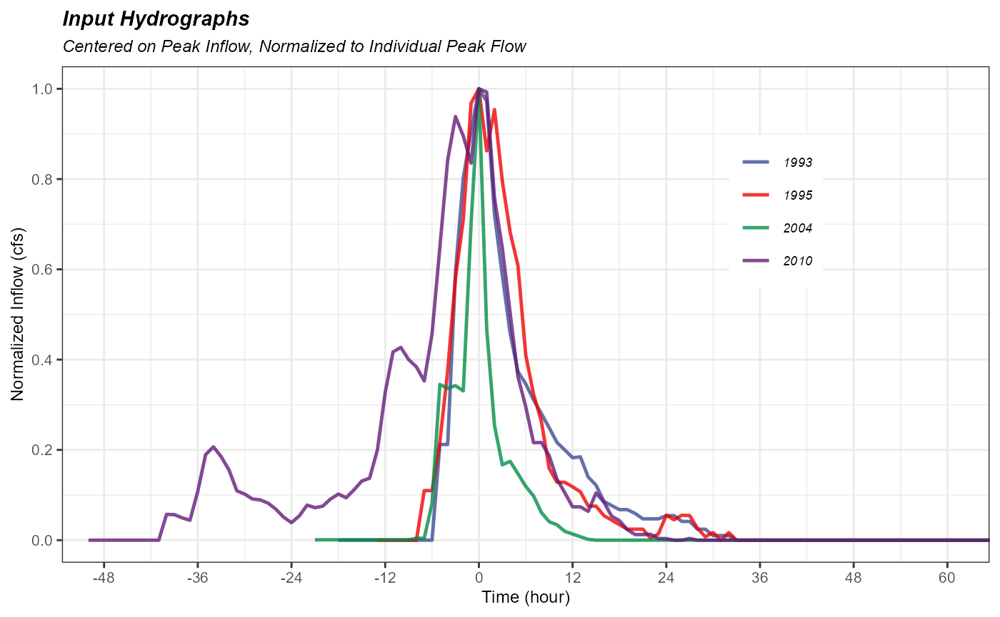
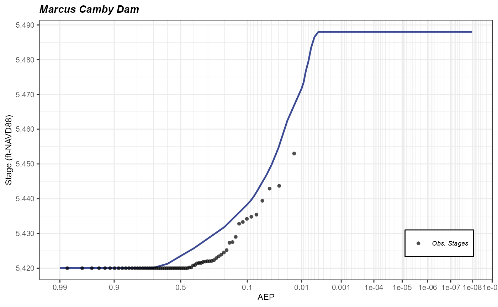

# MCD GEV Example

## Summary

This article steps through an example of `rfa_simulate` (expected only)
using a GEV inflow volume-frequency parameter set. The example will load
the required data and display the formatting currently required to
successful execute `rfa_simulate`. The example project is the Marcus
Camby Dam (MCD & `mcd_`).

## Analysis Set Up

The libraries loaded after `rfaR` are intended to make data analysis and
visualization easier.

All of the MCD data is stored in sub-directories within this parent
directory. Setting up the parent directory as an R-project can also make
searching for files/directories easier. An R-project will change the
working directory to the specified project location. For example,
setting `parent_dir` as the R-project directory would set the default
working directory (likely on the C: drive) to `parent_dir` (ex.
[`getwd()`](https://rdrr.io/r/base/getwd.html) would return
`"D:/0.RMC/Reefer/MC_Dam"`).

``` r
parent_dir <- "D:/0.RMC/Reefer/MC_Dam"
```

## Load Data

Currently, the preferred method of data entry for rfaR is copying data
from RMC-RFA into CSVs and saving them to a parent/project directory.
Future development will prioritize loading the data from RFA sqlite
files and less-rigid formatting requirements. The subsections below
provide an example of reading the data and the correct formatting. Data
will be presented as the R-console output as opposed to a formatted
table. Note that R-Studio refers to rows as `obs.` and columns as
`variables`.

### BestFit Parameter Sets

The BestFit parameter sets should be 10,000 rows and 3 columns. Each row
is a set of 3 parameters (for both GEV and LP3 parameter sets). Users
can include a 4th column, log-likelihood, if desired. All of the data is
numeric

    #>  location     scale     shape 
    #> "numeric" "numeric" "numeric"
    #>     location     scale      shape
    #> 1  -4.963966  76.53012 -0.9460919
    #> 2  13.314978  22.30832 -1.4426598
    #> 3  17.892810  41.34806 -2.0734547
    #> 4  -7.823617 141.50352 -0.3162466
    #> 5 -11.863676  65.69696 -0.6529099
    #> 6  -3.456479  48.62980 -1.0081875

### Seasonality

`rfaR` does not have a seasonality analysis module at this time. The
seasonality analysis from RMC-RFA should be copied as is from the
software. The seasonality data should have 12 rows and 4 columns. The
third column, `$relative_frequency` will be used in
[`rfa_simulate()`](https://ideal-broccoli-1q9y47z.pages.github.io/reference/rfa_simulate.md)
to sample the seasonality.

    #>              month          frequency relative_frequency cume_rel_frequency 
    #>        "character"          "integer"          "numeric"          "numeric"
    #>        month frequency relative_frequency cume_rel_frequency
    #> 1    January         4              0.148              0.148
    #> 2   February         7              0.259              0.407
    #> 3      March         9              0.333              0.741
    #> 4      April         1              0.037              0.778
    #> 5        May         0              0.000              0.778
    #> 6       June         0              0.000              0.778
    #> 7       July         0              0.000              0.778
    #> 8     August         0              0.000              0.778
    #> 9  September         0              0.000              0.778
    #> 10   October         2              0.074              0.852
    #> 11  November         1              0.037              0.889
    #> 12  December         3              0.111              1.000

### Stage Timeseries

`rfaR` modified the starting stage sampling method from RMC-RFA.
Observed stages are sampled corresponding to the sampled month
(seasonality). Therefore, columns of date and time are required in the
stage timeseries data. Currently,
[`rfa_simulate()`](https://ideal-broccoli-1q9y47z.pages.github.io/reference/rfa_simulate.md)
can only handle date time data in separate columns, as **character**
data. Future development will allow the user to specify if the date &
time data is already a formatted as date
([`as.Date()`](https://rdrr.io/r/base/as.Date.html)) and/or POSIXct
([`as.POSIXct()`](https://rdrr.io/r/base/as.POSIXlt.html)) objects.

The empirical stage frequency from RMC-RFA has been loaded below. This
data contains 2 columns of stage and corresponding plotting-position.

    #>    timestep        date        time    stage_ft 
    #>   "integer" "character" "character"   "numeric"
    #>   timestep     date time stage_ft
    #> 1        1 6/2/1958 0:00     5420
    #> 2        2 6/3/1958 0:00     5420
    #> 3        3 6/4/1958 0:00     5420
    #> 4        4 6/5/1958 0:00     5420
    #> 5        5 6/6/1958 0:00     5420
    #> 6        6 6/7/1958 0:00     5420

### Reservoir Model

The reservoir model is formatted identically to RMC-RFA. The model
should be three columns: stage, storage, and discharge and the stage
must be monotonic.

    #>    stage_ft stor_acft discharge_cfs
    #> 1    5420.1        20             0
    #> 10   5429.1       336             0
    #> 25   5444.1      2178             0
    #> 50   5469.1      8901          4051
    #> 60   5479.1     12816         14100

### Hydrograph Shapes

The hydrographs have been copied directly from RMC-RFA, including the
**Ordinate** column. The

    #>   Ordinate      Date  Time Flow
    #> 1        1  2/8/1993  1:00    0
    #> 2        2  2/8/1993  2:00    0
    #> 3        1 3/11/1995  1:00    0
    #> 4        2 3/11/1995  2:00    0
    #> 5        1 11/7/2004 12:00    1
    #> 6        2 11/7/2004 13:00    1
    #> 7        1 11/7/2004 12:00    1
    #> 8        2 11/7/2004 13:00    1

## Set up Hydrograph Shapes

    #>  [1] -60 -48 -36 -24 -12   0  12  24  36  48  60  72  84  96 108



## Expected-Only Stage-Frequency Analysis

## Display Results

The results have been plotted below on a standard `ggplot2` template.
Note that the AEPs of both the results and emprical stage-frequency were
converted to z-variates for plotting purposes.


